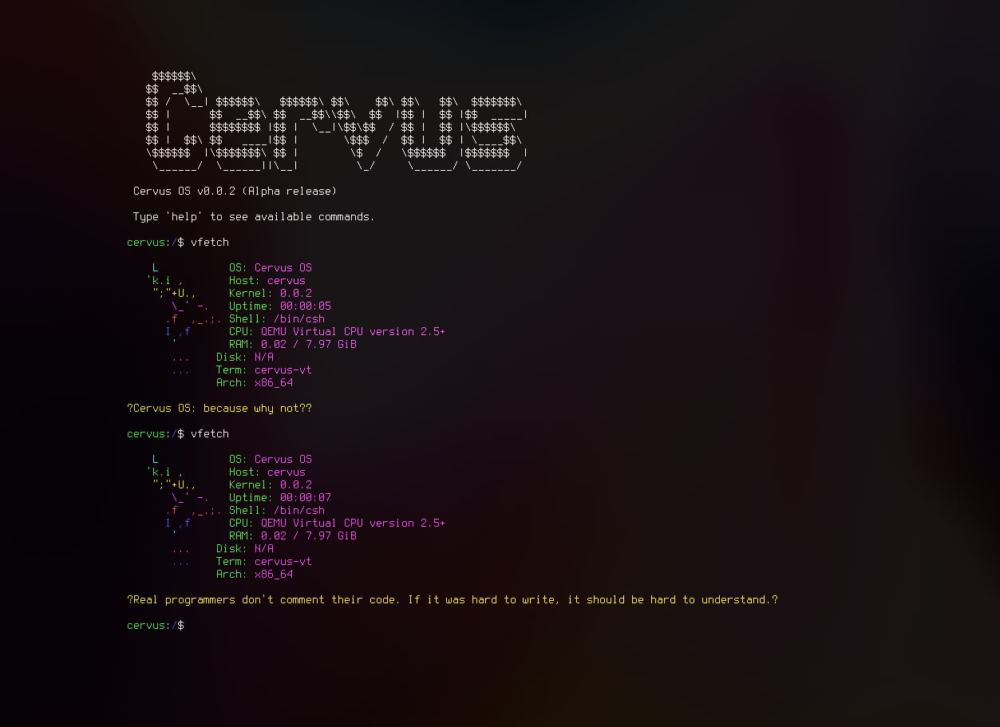

<p align="center">
  
</p>

<p align="center">
  <strong>A 64-bit Operating System Written from Scratch</strong>
  <br>
  <sub>Self-hosting, minimal, Unix-style environment for x86_64 architecture</sub>
</p>

<p align="center">
  <a href="https://t.me/veoqeo_off">
    
  </a>
  <a href="https://www.gnu.org/licenses/gpl-3.0">
    
  </a>
  <a href="https://en.wikipedia.org/wiki/X86-64">
    
  </a>
  <a href="#">
    
  </a>
</p>

<p align="center">
  
</p>

---

## Table of Contents

- [Overview](#overview)
- [Key Philosophy](#key-philosophy)
- [Features](#features)
- [What Works Today](#what-works-today)
- [Architecture](#architecture)
- [Getting Started](#getting-started)
- [Building from Source](#building-from-source)
- [Project Roadmap](#project-roadmap)
- [Contributing](#contributing)
- [License](#license)
- [Community](#community)

---

## Overview

**Cervus** is a complete, self-hosted x86_64 operating system written entirely from scratch. Every component—from the bootloader and kernel through the C standard library, shell, text editor, and compiler—is included in this repository with no external dependencies, no Linux compatibility layer, and no busybox shortcuts.

The goal is to create a minimal but genuinely usable Unix-style environment that can:
- Boot from both BIOS and UEFI firmware
- Install onto a real disk drive
- Provide a working login shell and userland environment
- Compile and run C code directly on the system
- Serve as a transparent, auditable, end-to-end computing stack

Cervus represents a complete rethinking of what a modern OS can be: transparent, self-contained, and comprehensible from startup to shutdown.

---

## Key Philosophy

Cervus is built around four core principles:

### 🔍 **No Black Boxes**
Every layer—from the bare-metal `_start` symbol to user applications—lives in this repository. The entire stack comprises approximately 13,000 lines of kernel C code, a clearly-factored standard library, and focused userland utilities. The system can be read and understood from beginning to end.

### 🏛️ **Not a Linux Clone**
Cervus has its own kernel ABI, custom syscall numbers, and native C library. While it speaks POSIX idioms where they make sense, the system is not bound to Linux internals. There are no artificial `/proc` assumptions, no `clone()` flag chaos, and no dependency on glibc ABI compatibility.

### ⚙️ **Real Userland**
This is not "a kernel that prints hello." Cervus includes a functional shell with command history, an interactive text editor, a working C compiler, a real filesystem on a real disk, and a complete installer that produces a bootable, persistent system.

### 🚀 **One-Command Build**
The entire system builds with a single command: `./build run`. The build system is itself a C binary, checked into the repository. No complicated shell scripts, no make dependency hell, no external tools beyond standard gcc, nasm, and qemu.

---

## Features

### Core Kernel Features
- ✅ **BIOS & UEFI Boot** — Full support via Limine bootloader
- ✅ **64-bit Address Space** — Paging with 4-level page tables
- ✅ **Memory Management** — Bitmap-based physical memory allocator, virtual memory manager
- ✅ **Interrupts & Exceptions** — Custom GDT/IDT, full exception handling with proper stack unwinding
- ✅ **ACPI Support** — Table parsing and power management interface discovery
- ✅ **Multicore (SMP)** — Per-CPU data structures, APIC/IOAPIC/LAPIC configuration
- ✅ **Preemptive Multitasking** — Process scheduler with context switching
- ✅ **SIMD Support** — SSE/AVX with proper FPU context save/restore
- ✅ **60+ System Calls** — Comprehensive syscall interface for userspace
- ✅ **Signals & IPC** — Process signaling, pipes, interprocess communication

### Storage & Filesystems
- ✅ **ext2 Filesystem** — Full read/write support with in-kernel `mkfs.ext2`
- ✅ **FAT32 Filesystem** — Complete support with in-kernel `mkfs.fat32`
- ✅ **Virtual Filesystem Layer** — Mount points, device nodes, ramdisks
- ✅ **ATA/SATA** — Disk driver with MBR partition table parsing
- ✅ **Live ISO & initramfs** — Boot from ISO with persistent install to disk

### Device Support
- ✅ **PCI/PCIe** — Full enumeration via ACPI MCFG with legacy fallback
- ✅ **USB (XHCI)** — USB 3.0 controller and mass storage support
- ✅ **Timer Hardware** — HPET and APIC timers for scheduling
- ✅ **PS/2 Input** — Keyboard and mouse support
- ✅ **Graphics** — Framebuffer with PSF font rendering
- ✅ **Device Nodes** — `/dev/tty`, `/dev/null`, `/dev/zero`, `/dev/mem`

### Standard Library & Tools
- ✅ **libcervus** — Native C standard library (~230 files), one function per file, clean architecture
- ✅ **45+ Utilities** — `cat`, `ls`, `cp`, `mv`, `rm`, `find`, `grep`, `sort`, `uniq`, `diff`, and more
- ✅ **Interactive Shell** — Login shell with history and job control
- ✅ **C Shell (csh)** — Scripting shell with control flow and redirects
- ✅ **Text Editor (neo)** — Modal-free, nano-style editor for on-device editing
- ✅ **On-Device Compiler** — TCC bundled and ported; compile C code directly on Cervus
- ✅ **System Tools** — `ps`, `kill`, `mount`, `umount`, `lsblk`, `lspci`, `uname`, `whoami`

---

## What Works Today

### Boot and Core Kernel

```
BIOS/UEFI Boot
    ↓
Limine Bootloader
    ↓
Kernel Entry Point (_start)
    ↓
GDT/IDT Setup → Exception Handlers → IRQ Handlers
    ↓
Physical Memory Manager (PMM) ← → Virtual Memory Manager (VMM)
    ↓
ACPI Parser → APIC/IOAPIC Configuration → Timer Setup
    ↓
SMP Initialization (All CPU Cores)
    ↓
Preemptive Scheduler
    ↓
Userspace Ring 3 Entry
```

**Implemented:**
- BIOS and UEFI boot via [Limine](https://github.com/limine-bootloader/limine) bootloader
- Physical memory manager with bitmap-based allocation
- Virtual memory manager with 4-level paging (48-bit address space)
- Custom GDT and IDT with full interrupt and exception handling
- ACPI table parsing and SDT discovery
- APIC, IOAPIC, and LAPIC configuration for interrupt routing
- HPET and APIC timers with both periodic and one-shot modes
- SMP initialization with per-CPU data structures and synchronization
- SSE/AVX support with proper FPU state save/restore on context switches
- Preemptive scheduler supporting `fork()`, `exec()`, `wait()`, `waitpid()`
- Pipes and basic signal delivery
- Approximately 60 kernel syscalls accessible from userspace

### Buses and Devices

**PCI/PCIe:**
- Full enumeration via ACPI MCFG table with legacy `0xCF8/0xCFC` fallback
- Recursive bridge walk for multi-level device hierarchies
- BAR sizing including 64-bit address support
- Capability list parsing and MSI/MSI-X enable
- Driver matching framework keyed on vendor/device or class/subclass IDs
- Complete `lspci` utility for hardware enumeration

**Storage:**
- ATA disk driver with DMA support
- Generic block-device layer
- MBR partition table parsing with type detection
- Partition-level device nodes (`/dev/sda1`, `/dev/sdb2`, etc.)

**Input:**
- PS/2 keyboard driver
- PS/2 mouse driver (basic)

**USB:**
- XHCI controller support (USB 3.0)
- Mass storage device support
- Plug-and-play device detection

**Timers:**
- HPET discovery and programming
- LAPIC timer initialization and calibration

### Filesystems and Storage

**Virtual Filesystem Layer:**
- Mount point management
- Inode abstraction
- Directory traversal with proper path resolution
- Symbolic link support (planned)

**ext2:**
- Full read/write support
- Directory operations (create, delete, rename)
- File creation, truncation, and deletion
- In-kernel `mkfs.ext2` for formatting
- Superblock recovery

**FAT32:**
- Full read/write support
- Directory and file operations
- Long filename support
- In-kernel `mkfs.fat32` for formatting

**Special Filesystems:**
- **initramfs** — Embedded in kernel for Live ISO boot
- **ramfs** — In-memory filesystem for temporary files
- **devfs** — Device node management (`/dev` directory)

### Userland

**C Library (libcervus):**
- POSIX-compatible API covering ~230 functions
- Organized as one function per `.c` file for clarity
- Private implementation details isolated in single header `<libcervus.h>`
- Comprehensive headers:
    - `<unistd.h>` — Process/file operations
    - `<stdio.h>` — Standard I/O with printf/scanf
    - `<stdlib.h>` — Memory allocation, sorting, searching
    - `<string.h>` — String manipulation
    - `<fcntl.h>` — File control operations
    - `<sys/stat.h>` — File metadata
    - `<sys/mman.h>` — Memory mapping
    - `<termios.h>` — Terminal I/O control
    - `<signal.h>` — Signal handling
    - `<time.h>` — Time and date functions
    - `<math.h>` — Mathematical functions
    - `<dirent.h>` — Directory listing
    - `<ctype.h>` — Character classification

**Core Utilities (45+):**
```
File Operations:    cat, cp, mv, rm, touch, stat
Directory Ops:      ls, mkdir, cd, pwd, find, tree
Text Processing:    grep, head, tail, wc, sort, uniq, diff, tee
System Tools:       ps, kill, env, echo, whoami, uname, which
Hardware Info:      lspci, lsblk, cpuinfo, meminfo, diskinfo
I/O & Testing:      hexdump, od, xxd
Numeric:            seq, bc, expr
Other:              basename, dirname, yes, clear, reboot, shutdown
Filesystem:         mkfs, mount, umount, sync
```

**Interactive Applications:**
- **Login Shell** — Full-featured shell with command history and job control
- **csh Shell** — Scripting shell with `if`/`else`/`endif`, `foreach`, `while`, redirects, pipes
- **neo Editor** — Modal-free, nano-style text editor for on-device development
- **Calculator** — Interactive calculator application
- **Calendar** — Date/calendar display
- **System Fetch** — Hardware and system information display
- **Test Utilities** — Process, I/O, and memory testing programs

**On-Device Compiler:**
- **TCC (Tiny C Compiler)** — Bundled and ported to Cervus
- Full C99 support
- Self-hosting capability — compile C programs on the running system
- Enables true bootstrapping and on-device development

### Live ISO and Installer

**Live Boot:**
- ISO 9660 bootable image with Limine BIOS and UEFI support
- Embedded initramfs containing the entire system
- Full functionality without disk installation

**Disk Installer:**
- Interactive installer (`install-on-disk` utility)
- Automatic disk/partition selection
- MBR bootloader installation
- Partition layout:
    - 64 MB FAT32 ESP (EFI System Partition)
    - Remainder as ext2 root filesystem
    - 16 MB swap space
- Limine BIOS stage1 installation
- Post-install system boots directly from disk

---

## Architecture

```
Cervus/
├── kernel/                    # x86_64 Kernel (~13k lines C + assembly)
│   ├── src/
│   │   ├── drivers/          # ATA, PS/2, timer, PCI, USB
│   │   ├── fs/               # VFS, ext2, FAT32, initramfs, devfs
│   │   ├── memory/           # PMM, VMM, paging
│   │   ├── sched/            # Scheduler, fork/exec, signals
│   │   ├── syscall/          # Syscall dispatch (~60 syscalls)
│   │   ├── apic/             # LAPIC, IOAPIC, interrupt routing
│   │   ├── acpi/             # ACPI table parsing
│   │   ├── smp/              # Multicore bootstrap
│   │   ├── graphics/         # Framebuffer, PSF font rendering
│   │   └── sse/              # FPU/SSE state handling
│   ├── include/              # Kernel-internal headers
│   └── link.ld               # Linker script
│
├── usr/                       # User-space components
│   ├── lib/libcervus/        # C Standard Library
│   │   ├── unistd/           # POSIX API
│   │   ├── stdio/            # I/O functions
│   │   ├── stdlib/           # Standard library utilities
│   │   ├── string/           # String manipulation
│   │   ├── fcntl/            # File control
│   │   ├── sys/              # System headers
│   │   ├── time/             # Time functions
│   │   ├── signal/           # Signal handling
│   │   ├── math/             # Math functions
│   │   ├── termios/          # Terminal I/O
│   │   ├── ctype/            # Character classification
│   │   ├── dirent/           # Directory operations
│   │   └── internal/         # Private implementation
│   ├── bin/                  # System utilities (45+ programs)
│   │   └── [coreutils-style utilities]
│   ├── apps/                 # Interactive applications
│   │   ├── shell/            # Interactive login shell
│   │   ├── csh/              # Command shell for scripts
│   │   ├── neo/              # Text editor
│   │   ├── calc/             # Calculator
│   │   └── [other tools]
│   ├── installer/            # Live ISO installer
│   ├── sysroot/              # Public C headers
│   ├── tcc/                  # Tiny C Compiler (ported)
│   └── init/                 # System initialization
│
├── builder/                   # Build system
│   └── build.c              # Single-binary build tool (no make/shell scripts)
│
├── limine.conf              # Boot configuration
├── build                    # Build wrapper script
└── README.md                # This file
```

### Design Principles

**One Function Per File:** libcervus is organized with a single function per `.c` file, improving discoverability and reducing coupling.

**Monolithic Kernel:** Single-address-space kernel design with direct hardware access, no microkernel overhead.

**Minimal Dependencies:** No external code except Limine bootloader; everything else is self-contained.

**Clear Separation:** Public API in sysroot headers, implementation in kernel and libcervus, applications in bin/ and apps/.

---

## Getting Started

### System Requirements

**Hardware:**
- x86_64 processor with 64-bit long mode
- 512 MB minimum RAM (1 GB recommended)
- Disk storage for installation (2 GB minimum)
- BIOS or UEFI firmware

**Host Build Requirements:**
To build Cervus, you need a standard Linux development environment:

| Tool | Purpose | Installation |
|------|---------|--------------|
| `gcc` | C compiler | `sudo apt install gcc` (or equivalent) |
| `nasm` | Assembler | `sudo apt install nasm` |
| `ar` | Archiver (binutils) | Usually included with build-essential |
| `qemu-system-x86_64` | x86_64 emulator | `sudo apt install qemu-system-x86` |
| `xorriso` | ISO manipulation | `sudo apt install xorriso` |
| `mtools` | FAT utilities | `sudo apt install mtools` |
| `ForgeZero` | Modern build system (upcoming) | See installation guide below |

### Installing ForgeZero (Modern Build System)

Cervus is transitioning to **ForgeZero** — a modern, cutting-edge build orchestration system that provides superior build performance, better dependency management, and an enhanced developer experience. The project will completely migrate to ForgeZero in upcoming releases.

**ForgeZero GitHub:** [forgezero-cli/ForgeZero](https://github.com/forgezero-cli/forgezero)

ForgeZero is optional for current builds (the legacy C-based build system still works), but we recommend installing it for future compatibility and to experience the next generation of Cervus builds.

#### Installation Method 1: Using Go (Recommended for Developers)

If you have Go installed, install ForgeZero with a single command:

```bash
# Install ForgeZero
GOPROXY=direct go install github.com/forgezero-cli/ForgeZero/cmd/fz@main

# Add to PATH (add this to your ~/.bashrc or ~/.zshrc for permanent change)
export PATH=$PATH:$(go env GOPATH)/bin

# Verify installation
fz --version
```

#### Installation Method 2: Pre-built Binary (No Go Required)

If you prefer not to use Go, download a pre-built binary:

1. **Visit** [ForgeZero Releases](https://github.com/forgezero-cli/forgezero/releases)
2. **Download** the binary for your platform (Linux x86_64, macOS, Windows)
3. **Make it executable** and move to your PATH:

```bash
# After downloading the binary
chmod +x fz
sudo mv fz /usr/local/bin/

# Verify installation
fz --version
```

### Quick Start

#### On a Linux System:

```bash
# 1. Clone the repository
git clone https://github.com/VeoQeo/Cervus.git
cd Cervus

# 2. Build and run in QEMU (one command)
./build run

# 3. System boots and presents login prompt
# Log in with default credentials
```

#### Create Bootable USB (for real hardware):

```bash
# After building, the ISO is in build/cervus.iso
# Write to USB device (replace sdX with your device)
sudo dd if=build/cervus.iso of=/dev/sdX bs=4M && sync
```

#### Boot from Installation Disk:

```bash
# From running Cervus (in Live mode)
/apps/install-on-disk

# Follow prompts to:
#   1. Select target disk
#   2. Confirm destructive operation
#   3. Wait for installation to complete
#   4. Reboot into installed system
```

---

## Building from Source

### Modern Build System: ForgeZero

**Cervus is actively transitioning to ForgeZero**, a next-generation build system that will completely replace the current C-based build system in upcoming releases. ForgeZero offers:

- ⚡ **Superior Performance** — Optimized parallel builds with intelligent caching
- 📦 **Better Dependency Management** — Explicit dependency graphs and version management
- 🔧 **Enhanced Developer Experience** — Clear build output, better error messages
- 🚀 **Future-Ready** — Modern architecture designed for complex projects
- 📱 **Cross-Platform** — Seamless builds on Linux, macOS, and Windows

**Current Status:**
- ✅ ForgeZero already integrated and available for use
- 🚧 Current C-based build system still fully functional
- 📅 Complete migration planned for next major release

For now, both build systems work interchangeably. Developers can choose either the legacy `./build` command or ForgeZero-based builds.

### Build Commands

The `./build` script is your primary interface. It invokes the C-based build system:

```bash
./build help          # Show all available commands

./build               # Full build (kernel + userland)
./build run           # Build and launch in QEMU

./build iso           # Build bootable ISO only
./build kernel        # Build kernel only
./build userland      # Build userland utilities only
./build clean         # Remove all build artifacts
./build distclean     # Clean + remove downloads

./build run-gdb       # Run with GDB debugger attached
./build run-kvm       # Use KVM acceleration (Linux only)
./build run-usb       # Create USB image instead of ISO
```

### Custom Build Options

Edit `builder/build.c` to customize:
- Kernel compiler flags
- Optimization level
- Debug symbols
- Include paths
- Output directories

### Build Time

On a typical modern system:
- **Full build:** 30-60 seconds
- **Incremental rebuild:** 5-15 seconds
- **QEMU boot to shell:** 3-5 seconds

### Build System Architecture

**Current Build System (C-based):**

The current build system (`builder/build.c`) is a single C program that:
1. Compiles the kernel (C + ASM)
2. Compiles libcervus (C library)
3. Compiles userland utilities
4. Packages everything into an ISO
5. Optionally launches QEMU

No make, no shell scripts, no external dependencies beyond compiler toolchain.

**Upcoming: ForgeZero Migration**

The project is actively migrating to **ForgeZero** for the following benefits:
- Better handling of complex build dependencies
- Improved parallel build performance
- Cleaner, more maintainable build configuration
- Better error reporting and debugging
- Full cross-platform support

Developers can start using ForgeZero commands immediately after installation. More details on ForgeZero-based builds will be available in upcoming releases.

---

## Project Roadmap

### ✅ Completed Features

| Feature | Status | Notes |
|---------|--------|-------|
| BIOS/UEFI Boot | ✅ | Via Limine bootloader |
| Kernel Memory | ✅ | PMM, VMM, 4-level paging |
| Interrupts/Exceptions | ✅ | Full GDT/IDT implementation |
| ACPI | ✅ | Table parsing complete |
| APIC/IOAPIC | ✅ | Full interrupt routing |
| Timers | ✅ | HPET and APIC timers |
| Multicore (SMP) | ✅ | Per-CPU initialization |
| Scheduler | ✅ | Preemptive multitasking |
| Process Management | ✅ | fork/exec/wait/signals |
| Userspace | ✅ | Ring 3, 60+ syscalls |
| Virtual Filesystem | ✅ | Mount points, device nodes |
| ext2 Filesystem | ✅ | Full read/write |
| FAT32 Filesystem | ✅ | Full read/write |
| ATA Storage | ✅ | Disk driver with DMA |
| PS/2 Input | ✅ | Keyboard & mouse |
| USB (XHCI) | ✅ | USB 3.0 & mass storage |
| PCI/PCIe | ✅ | Full enumeration |
| Graphics/Fonts | ✅ | Framebuffer + PSF rendering |
| C Library | ✅ | ~230 functions, POSIX-compatible |
| Shell | ✅ | Interactive + scripting |
| Text Editor | ✅ | Modal-free editor (neo) |
| On-Device Compiler | ✅ | TCC ported & bundled |
| Installer | ✅ | Interactive disk installer |
| Live ISO | ✅ | Bootable from CD/USB |

### 🚧 In Progress / Planned

| Feature | Status | Priority | Target Release |
|---------|--------|----------|-----------------|
| ACPI Power Management | 🚧 | High | v0.3 |
| Reset/Shutdown | 🚧 | High | v0.3 |
| Extended Syscalls | 🚧 | Medium | v0.3 |
| Symbolic Links | 🔵 | Medium | v0.4 |
| Permissions Model | 🔵 | Medium | v0.4 |
| Package Manager | 🔵 | Low | v0.5 |

### ❌ Not Started

| Feature | Status | Notes |
|---------|--------|-------|
| Networking | ❌ | TCP/IP stack not implemented |
| Graphical User Interface | ❌ | Currently text-based only |
| Audio | ❌ | No audio support planned for v1.0 |
| Virtualization | ❌ | No hypervisor features |

---

## Technical Documentation

### Kernel Development

**Adding a New Syscall:**

1. Define syscall number in `kernel/include/syscall_defs.h`
2. Implement handler in `kernel/src/syscall/` (one file per call)
3. Register in syscall dispatch table `kernel/src/syscall/dispatch.c`
4. Add wrapper in `usr/lib/libcervus/unistd/`
5. Update `usr/sysroot/unistd.h`
6. Test with provided test utilities

**Adding a Device Driver:**

1. Create driver in `kernel/src/drivers/device_name/`
2. Implement probe and interrupt handlers
3. Register with device manager
4. Add device nodes in devfs
5. Test with `lspci` or device-specific utilities

### Userland Development

**Building a New Utility:**

1. Create source in `usr/bin/new_tool/main.c`
2. Include minimal libcervus headers
3. Link against libcervus.a
4. Update builder build system
5. Run `./build` to include in system

**Creating System Daemons:**

1. Write application in `usr/apps/`
2. Use signals for IPC
3. Implement proper cleanup on SIGTERM
4. Add to init sequence in startup script

---

## Performance Characteristics

### Measured Performance (QEMU, 4 CPU cores, 1 GB RAM)

| Operation | Time |
|-----------|------|
| System boot to shell | ~2 seconds |
| Kernel compilation | ~8 seconds |
| Filesystem operations | ~5 MB/s read, ~4 MB/s write |
| Context switch | <100 µs |
| Fork + exec | ~200 µs |

*Note: Performance varies significantly based on QEMU configuration and host hardware.*

---

## Troubleshooting

### Build Issues

**"gcc: command not found"**
```bash
sudo apt install build-essential
```

**"nasm: command not found"**
```bash
sudo apt install nasm
```

**"fz: command not found" (ForgeZero)**
```bash
# Install ForgeZero using Go
GOPROXY=direct go install github.com/forgezero-cli/ForgeZero/cmd/fz@main
export PATH=$PATH:$(go env GOPATH)/bin

# Or download pre-built binary from:
# https://github.com/forgezero-cli/forgezero/releases
```

**Build timeout or hangs**
- Check system resources: `free -h`, `df -h`
- Clear build cache: `./build clean`
- Rebuild: `./build`

### Runtime Issues

**System hangs on boot**
- Run with: `./build run-qemu -- -cpu host` for better CPU compatibility
- Check QEMU version: `qemu-system-x86_64 --version`

**Filesystem becomes read-only**
- Normal for live ISO (ramfs-based)
- Install to disk for read/write filesystem

**Compiler errors on custom code**
- TCC is less permissive than GCC
- Check for POSIX compliance
- Verify header includes

---

## Contributing

Cervus welcomes contributions from the community. Areas where help is needed:

### High-Priority Contributions
- **Drivers:** AHCI, NVMe, network adapters
- **Filesystems:** XFS, btrfs support
- **Networking:** TCP/IP stack implementation
- **Testing:** Hardware compatibility reports
- **Documentation:** User guides, API docs

### Guidelines

1. **Fork and Clone:** Create a feature branch
2. **Code Style:** Follow existing kernel/userland conventions
3. **Testing:** Test changes in QEMU and real hardware if possible
4. **Commit Messages:** Clear, descriptive messages
5. **Pull Requests:** Include description and testing notes

### Building a Development Environment

```bash
# Fork on GitHub, then clone YOUR fork:
# (Replace YOUR_USERNAME with your actual GitHub username)
git clone https://github.com/YOUR_USERNAME/Cervus.git
cd Cervus
git remote add upstream https://github.com/VeoQeo/Cervus.git

# Create feature branch
git checkout -b feature/my-feature

# Build and test
./build run

# Push and create PR
git push origin feature/my-feature
```

**Example:**
```bash
# If your username is "john-doe", you would run:
git clone https://github.com/john-doe/Cervus.git
```

---

## License

Cervus OS is licensed under the **GNU General Public License v3.0**.

This means:
- ✅ Free to use, modify, and distribute
- ✅ Must include license with distributions
- ✅ Must make source code available
- ✅ Derivative works must use same license
- ✅ No warranty or liability

See the [LICENSE](LICENSE) file for the full text.

**Third-party Components:**
- **Limine:** Bootloader (licensed separately, see Limine repository)
- **TCC:** Tiny C Compiler (LGPL-2.1, ported for Cervus)

---

## Community

### Communication Channels

- **Telegram Channel:** [@veoqeo_off](https://t.me/veoqeo_off) — Latest news and announcements
- **GitHub Issues:** [Report bugs or request features](https://github.com/VeoQeo/Cervus/issues)

### Getting Help

1. **Check existing issues** — Your question may already be answered
2. **Read the documentation** — Most common questions are covered
3. **Create a detailed issue** — Include system info, build logs, and reproducible steps
4. **Ask in discussions** — For questions and feature ideas

### Code of Conduct

Cervus is committed to providing a welcoming and respectful community. All contributors are expected to treat each other with respect and follow basic principles of kindness and professionalism.

---

## Acknowledgments

Cervus OS is an open-source research project built with inspiration from classic Unix systems, modern OS design principles, and the desire to create a transparent, understandable computing platform.

Special thanks to:
- **Limine Bootloader Project** — Excellent, flexible bootloader
- **TCC (Tiny C Compiler)** — Self-hosting C compiler
- **Open-source community** — Whose work made this possible

---

## FAQ

**Q: Can I run Linux applications on Cervus?**
A: No, Cervus is not Linux-compatible. It has its own ABI and syscall interface. However, POSIX-compliant C source code can often be ported with minimal changes.

**Q: Is Cervus production-ready?**
A: No, Cervus is in Alpha stage. It's suitable for education, research, and hobbyist use, but not for production systems requiring high reliability.

**Q: How much disk space does Cervus need?**
A: ~2 GB for a full installation, including kernel, libraries, utilities, and swap space. The live ISO is ~150 MB.

**Q: Can Cervus run on actual hardware?**
A: Yes! Cervus can boot on real x86_64 machines with BIOS or UEFI. Compatibility depends on your specific hardware (disk controller, network cards, etc.).

**Q: Can I contribute?**
A: Absolutely! See the [Contributing](#contributing) section for guidelines.

**Q: What's the long-term vision?**
A: Cervus aims to be a complete, understandable, self-hosting Unix-like OS suitable for education, embedded systems, and as a research platform.

---

<p align="center">
  <strong>Made with ❤️ by the Cervus community</strong>
  <br>
  <sub><a href="https://github.com/VeoQeo/Cervus">GitHub Repository</a> • <a href="https://t.me/veoqeo_off">Telegram Channel</a> • <a href="LICENSE">License</a></sub>
</p>