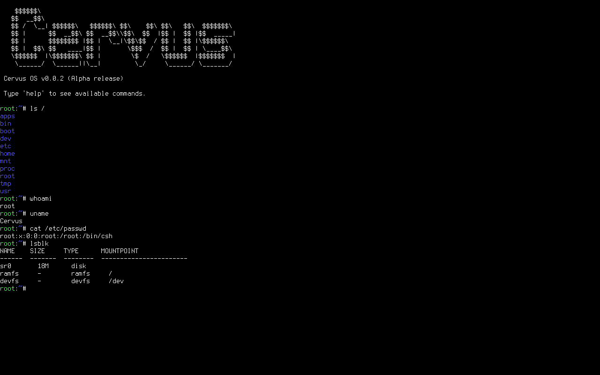
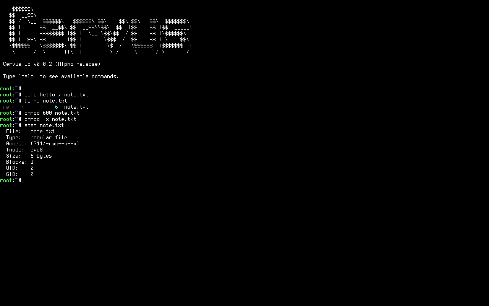
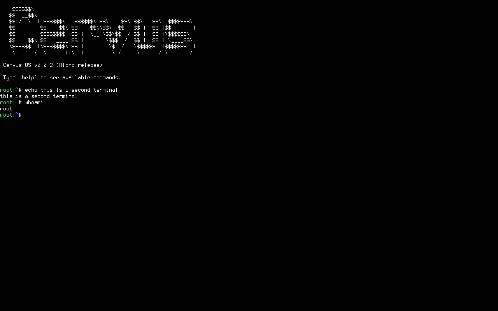
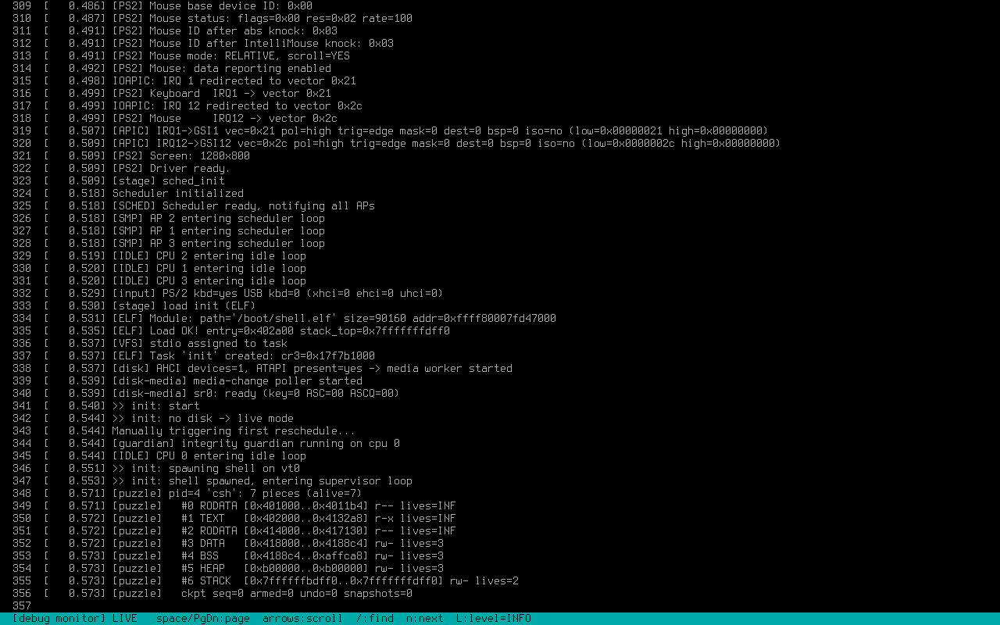
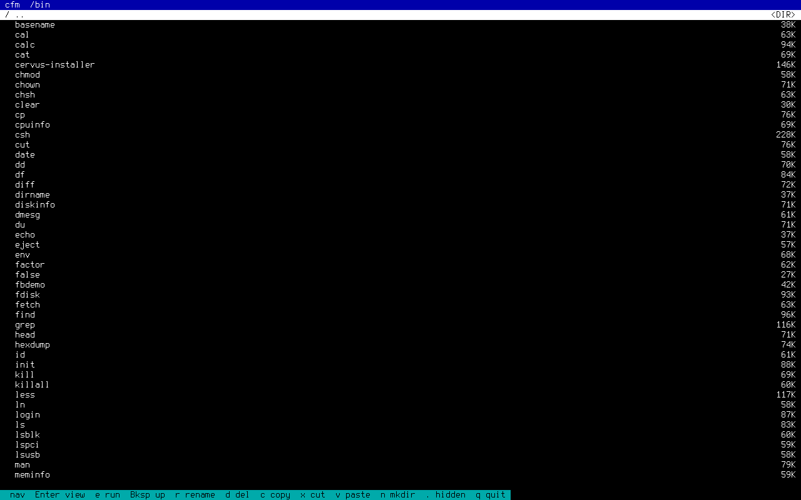
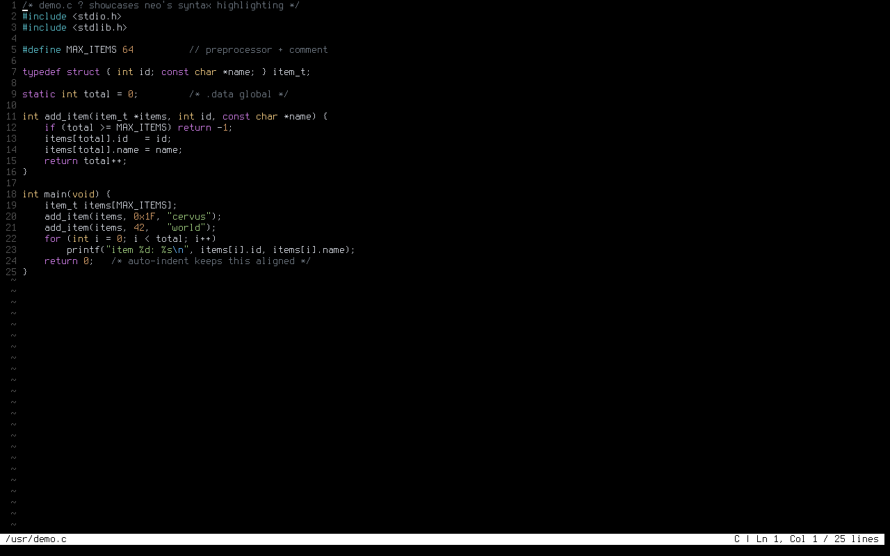

<p align="center">
  
</p>

<h1 align="center">Cervus</h1>

<p align="center">
  <strong>A 64-bit, self-hosting operating system for x86_64, written from scratch in C.</strong>
  <br>
  <sub>Kernel, C library, shell, utilities, editor, file manager, compiler, and installer — all native, no Linux underneath.</sub>
</p>

<p align="center">
  <a href="https://t.me/veoqeo_off"></a>
  <a href="https://www.gnu.org/licenses/gpl-3.0"></a>
  
  
  
</p>

<p align="center">
  
</p>

---

## Table of Contents

- [Introduction](#introduction)
- [Design Philosophy](#design-philosophy)
- [Feature Overview](#feature-overview)
- [System Architecture](#system-architecture)
  - [Boot Process](#boot-process)
  - [Physical and Virtual Memory](#physical-and-virtual-memory)
  - [Scheduling and SMP](#scheduling-and-smp)
  - [Timekeeping](#timekeeping)
  - [Interrupts and Exceptions](#interrupts-and-exceptions)
  - [System Calls](#system-calls)
- [System Call Reference](#system-call-reference)
- [Device Drivers](#device-drivers)
  - [Input: PS/2 keyboard and mouse](#input-ps2-keyboard-and-mouse)
  - [USB stack](#usb-stack)
  - [Storage](#storage)
  - [PCI / PCIe](#pci--pcie)
  - [Graphics and the framebuffer console](#graphics-and-the-framebuffer-console)
- [Filesystems](#filesystems)
- [Users, Permissions, and Authentication](#users-permissions-and-authentication)
- [Virtual Terminals](#virtual-terminals)
- [The Debug Monitor](#the-debug-monitor)
- [splinterkernel: Speculative Execution](#splinterkernel-speculative-execution)
- [Resilience](#resilience)
- [The Shell (csh)](#the-shell-csh)
- [Userland Utilities](#userland-utilities)
- [The Text Editor (neo)](#the-text-editor-neo)
- [The File Manager (cfm)](#the-file-manager-cfm)
- [On-Device Compiler (tcc)](#on-device-compiler-tcc)
- [The Installer](#the-installer)
- [Keyboard Reference](#keyboard-reference)
- [Building from Source](#building-from-source)
- [Running in QEMU](#running-in-qemu)
- [Repository Layout](#repository-layout)
- [FAQ and Troubleshooting](#faq-and-troubleshooting)
- [Roadmap](#roadmap)
- [Contributing](#contributing)
- [Community](#community)
- [License](#license)

---

## Introduction

**Cervus** is a monolithic operating system for the x86_64 architecture, written
entirely from scratch in C and a small amount of assembly. Every layer of the system
lives in this repository: the bootloader integration, the kernel, the C library, the
shell, the userland utilities, the text editor, the file manager, the on-device C
compiler, and the disk installer. There is no Linux compatibility layer, no glibc,
and no BusyBox — every component is native to Cervus.

The project has one guiding goal: a system small enough to be read and understood end
to end, yet complete enough to be genuinely usable. Cervus boots on both BIOS and
UEFI firmware, installs to a real disk, authenticates multiple users, runs a
Unix-style shell with scripting, and compiles C code on the machine itself.

Cervus is an **alpha-stage hobby operating system**. It is a platform for study,
experimentation, and OS development — not a production system. Interfaces change, and
hardware support is limited to what has been implemented and tested.

---

## Design Philosophy

**Self-contained.** The whole stack, from the first instruction after the bootloader
to the login prompt, is in this tree. There is no external runtime and no binary
blobs in the userland; the compiler that runs on Cervus was built for Cervus.

**Its own system, not a Linux clone.** Cervus has its own kernel ABI and syscall
numbering. It follows POSIX conventions where they are sensible — file modes, user
IDs, `fork`/`exec`, standard I/O — but it is not bound to Linux internals. Programs
are ordinary ELF64 executables using the Cervus C library.

**The kernel is the authority.** Security-relevant decisions — privilege changes,
password verification, permission checks — are made inside the kernel, never in
userland helpers that could be bypassed. A userland program cannot talk itself into
being root.

**Simple, reproducible builds.** A small POSIX shell script generates a Ninja build
file; incremental builds and parallelism are handled by Ninja. The only host tools
required are a C compiler, `nasm`, `ninja`, `qemu`, and `xorriso`.

**Comprehensible failure.** When something goes wrong, the system tries to recover a
single task rather than taking down the machine, and it keeps a readable in-kernel
log you can scroll through live (see [The Debug Monitor](#the-debug-monitor)).

---

## Feature Overview

| Area | Highlights |
|------|------------|
| **Boot** | Limine bootloader, BIOS and UEFI, live ISO + persistent ext2 install |
| **CPU / memory** | Long mode, 4-level paging, buddy + slab allocators, SMP across all cores |
| **Scheduling** | Preemptive, per-priority ready queues, per-CPU state, SSE/FPU save/restore |
| **Time** | TSC/LAPIC clocksource cascade with watchdog and drift recalibration |
| **Syscalls** | POSIX-style process, file, memory, and time calls plus Cervus extensions |
| **Filesystems** | VFS with ext2, FAT32, ISO9660, UDF, ramfs, initramfs, devfs, procfs |
| **Storage** | AHCI/SATA, legacy ATA, NVMe; MBR and GPT partitions; block layer |
| **USB** | xHCI, EHCI, UHCI; HID (keyboard/mouse) and Mass Storage class drivers |
| **Input / video** | PS/2 keyboard + mouse, en/ru keymaps, framebuffer console, PSF2 fonts, UTF-8 |
| **Security** | Multi-user, SHA-256 shadow passwords, `login`/`su`/`sudo`, POSIX permissions, capabilities, exec bit |
| **Concurrency** | `splinterkernel` thread-level speculation engine |
| **Resilience** | Process regeneration and kernel fault recovery |
| **Userland** | `csh` shell, ~70 utilities, `neo` editor (C syntax highlighting), `cfm` file manager, `tcc` compiler |
| **Terminals** | 12 virtual terminals, per-terminal login, a live debug monitor |

---

## Quick Start

If you just want to see Cervus running, the shortest path is a live boot in QEMU:

```sh
git clone https://github.com/VeoQeo/Cervus.git
cd Cervus
./nb run --live
```

The first invocation fetches and builds the dependencies (this happens once), builds
the kernel and the live ISO, and boots it. You land at a shell:

```
root:~# uname
Cervus
root:~# ls /
apps  bin  boot  dev  etc  home  mnt  proc  root  tmp  usr
root:~# help          # list built-in commands
```

To try the multi-user system end to end, install to a (virtual) disk:

```sh
./nb run              # boot the live image with a blank disk attached
```

Inside the VM, launch the installer (or accept the prompt that appears when an empty
disk is found), choose **Install**, set the root password, and create a user. Then
reboot from the installed disk:

```sh
./nb run --installed
```

Now the system boots to a login prompt. Log in as your user, and try the permission
system:

```sh
whoami                # your user name
echo hello > note     # create a file
chmod 400 note        # make it read-only
echo x > note         # permission denied — the read-only bit is enforced
sudo whoami           # prompts for your password, prints: root (if you are a sudoer)
```

While the system is booting or if something misbehaves, press `Ctrl+Alt+F2` to open
the [debug monitor](#the-debug-monitor) and read the kernel log.

---

## System Architecture

Cervus is a monolithic kernel: drivers, filesystems, the scheduler, and the memory
manager all run in kernel space (ring 0), and user programs run in ring 3 and reach
the kernel through the `syscall` instruction.

### Boot Process

Cervus boots under the [Limine](https://github.com/limine-bootloader/limine)
bootloader, which supports both BIOS and UEFI firmware. Limine loads the kernel and
passes it a boot-information structure through the Limine protocol: a linear
framebuffer, the physical memory map, the higher-half direct map (HHDM) offset, ACPI
pointers, and any modules.

```
Firmware (BIOS or UEFI)
        |
        v
Limine bootloader  ──►  loads kernel + initramfs module, sets up long mode
        |
        v
kernel entry (_start)
        |
        +── GDT / IDT / TSS
        +── physical memory manager (buddy) + slab allocator
        +── virtual memory: higher-half kernel, per-CPU stacks
        +── ACPI table discovery
        +── APIC / IOAPIC / LAPIC, clocksource calibration
        +── SMP bring-up (all application processors)
        +── driver initialization (PCI, storage, USB, input, framebuffer)
        +── VFS mount, root selection (initramfs on live, ext2 on installed)
        |
        v
first userspace process: /bin/init  ──►  spawns the shell (or login) on VT0
```

The live image is an ISO carrying an initramfs, which is unpacked into a RAM
filesystem at boot. An installed system instead boots directly from its ext2 root
partition.

### Physical and Virtual Memory

- **Physical allocator.** A buddy allocator manages physical frames in
  power-of-two blocks, which keeps external fragmentation low and makes multi-page
  allocations cheap. A slab allocator sits on top for small, frequently used kernel
  objects.
- **Virtual memory.** The VMM uses 4-level paging over the 48-bit canonical address
  space. The kernel is mapped in the higher half and shared by all address spaces;
  each process has its own lower-half mapping. Page permission bits distinguish
  writable, user-accessible, and no-execute pages.
- **Deadlock avoidance.** The physical allocator records which CPU holds its lock, so
  a fault taken while the lock is held can force-release it during recovery instead
  of hanging the machine — see [Resilience](#resilience).

### Scheduling and SMP

The scheduler is preemptive and symmetric across all detected CPU cores.

- Runnable tasks are held in **per-priority ready queues**; the scheduler picks the
  highest-priority runnable task.
- Each CPU maintains its own **per-CPU area**: the current task, run state, and
  scratch space used by the syscall fast path.
- Application processors are started through the standard APIC init/startup IPI
  sequence and then enter the shared scheduler.
- On every context switch the kernel saves and restores SSE/FPU state with
  `FXSAVE`/`FXRSTOR`, so floating-point and SIMD code is safe across preemption.
- The process model provides `fork`, `execve`, `wait`/`waitpid`, `exit`, process
  groups, and sessions.

### Timekeeping

Cervus builds a **clocksource cascade** behind a single monotonic nanosecond
interface:

- The TSC is calibrated against the LAPIC timer at boot, with HPET and the legacy PIT
  as fallbacks on machines where a source is missing or unreliable.
- A **watchdog** periodically cross-checks the active source; non-invariant TSCs are
  rated down so a better source wins.
- After boot, a recalibration pass corrects the initial frequency estimate.

Everything that needs time — the scheduler tick, `sleep`, uptime, one-shot timers —
draws from this layer, so behavior stays consistent whether or not a given machine
has an HPET.

### Interrupts and Exceptions

A custom **GDT**, **IDT**, and **TSS** are installed early. The IDT wires up the full
set of CPU exception vectors (page fault, general protection fault, and so on) and
the hardware IRQ vectors. Interrupt routing is programmed through the LAPIC and
IOAPIC, and end-of-interrupt is signaled to the LAPIC. Machines with **multiple
IOAPICs** (common on AMD platforms) are handled by resolving each global system
interrupt to the chip that actually owns it, so keyboard and other legacy IRQs are
delivered correctly rather than programmed into the wrong controller.

A fault taken in **user** context terminates the offending process. A fault taken in
**kernel** context while serving a user task is handled by the recovery path
described in [Resilience](#resilience) rather than immediately halting.

### System Calls

User programs enter the kernel through the `syscall` instruction (with `sysret` on
return), using a register-based ABI. The call number is passed in a register along
with up to six arguments; the return value (or a negative error number) comes back in
a register.

The interface is POSIX-style for the common operations and adds Cervus-specific calls
for things Linux exposes through other mechanisms (framebuffer access, USB and disk
management, authentication, the speculation engine). The next section lists them.

---

## System Call Reference

System call numbers are defined in `kernel/include/syscall/syscall_nums.h`. POSIX-style
calls occupy low numbers (with gaps left for growth); Cervus-specific calls start at
512.

### Process and task control

| Number | Name | Purpose |
|-------:|------|---------|
| 0 | `exit` | Terminate the calling process |
| 1 | `exit_group` | Terminate the process group |
| 2 | `getpid` | Process ID |
| 3 | `getppid` | Parent process ID |
| 4 | `fork` | Duplicate the current process |
| 5 | `wait` | Wait for a child to change state |
| 6 | `yield` | Yield the CPU |
| 7 / 8 | `getuid` / `getgid` | Real user / group ID |
| 9 / 10 | `setuid` / `setgid` | Set user / group ID (privileged) |
| 11 / 12 | `cap_get` / `cap_drop` | Query / drop capabilities |
| 13 | `task_info` | Per-task information (used by `ps`, `top`) |
| 14 | `execve` | Replace the process image (honors `#!` and the exec bit) |
| 15–18 | `getpgid` / `setpgid` / `getsid` / `setsid` | Process groups and sessions |

### Files, directories, and I/O

| Number | Name | Purpose |
|-------:|------|---------|
| 20–24 | `read` `write` `open` `close` `seek` | Basic file I/O |
| 25 / 26 | `stat` / `fstat` | File metadata by path / descriptor |
| 27 | `ioctl` | Device control (terminal modes, cursor, …) |
| 28 / 29 | `dup` / `dup2` | Duplicate a descriptor |
| 30 | `pipe` | Create a pipe |
| 31 | `fcntl` | Descriptor flags |
| 32 / 33 | `readdir` / `getdents` | Directory entries |
| 100–103 | `unlink` `rmdir` `mkdir` `rename` | Namespace operations |
| 104 / 105 | `statvfs` / `sync` | Filesystem stats / flush |
| 106 / 107 | `chdir` / `getcwd` | Working directory |
| 108 | `list_mounts` | Enumerate mounts |
| 109–112 | `truncate` `ftruncate` `fsync` `fdatasync` | Size / durability |
| 113 / 114 | `symlink` / `readlink` | Symbolic links |
| 115 / 116 | `chmod` / `chown` | Permission and ownership |

### Memory and time

| Number | Name | Purpose |
|-------:|------|---------|
| 40–43 | `mmap` `munmap` `mprotect` `brk` | Address-space management |
| 60 | `clock_get` | Read a clock |
| 61 | `sleep_ns` | Sleep for a duration |
| 62 | `uptime` | System uptime |
| 63 | `meminfo` | Memory statistics |
| 80 / 81 | `futex_wait` / `futex_wake` | Fast userspace synchronization |

### Cervus-specific (512+)

| Number | Name | Purpose |
|-------:|------|---------|
| 512 / 513 | `dbg_print` / `dbg_dump` | Kernel-log / debug output |
| 514 / 515 | `task_spawn` / `task_kill` | Spawn / signal tasks |
| 516–520 | `shmem_*`, `ipc_*` | Shared memory and message IPC |
| 521 / 522 | `ioport_read` / `ioport_write` | Port I/O (privileged) |
| 523 / 524 | `shutdown` / `reboot` | Power control |
| 530–549 | `disk_*` | Mount, format, partition (MBR/GPT), raw I/O, BIOS install, eject |
| 550 / 551 | `pci_list` / `usb_list` | Bus enumeration (for `lspci`, `lsusb`) |
| 553–556 | `vt_*` | Virtual-terminal spawn/switch/ctty control |
| 560–564 | `fb_*` | Framebuffer info/blit/map/acquire/release |
| 565 / 566 | `mouse_state` / `keymap_config` | Mouse position, keyboard layout |
| 567 | `klog` | Read/append the kernel log |
| 568 | `puzzle` | Process-regeneration control |
| 569 | `spec` | Speculative-execution engine |
| 570–572 | `auth` / `sudo` / `passwd_set` | Authentication and privilege |

### Return values and error numbers

A system call returns a non-negative value on success, or a **negated error number**
on failure — the same convention the kernel uses internally. The C library turns the
negative value into a `-1` return with `errno` set. The error numbers follow the
usual POSIX names and values, for example:

| Value | Name | Meaning |
|------:|------|---------|
| 1 | `EPERM` | Operation not permitted |
| 2 | `ENOENT` | No such file or directory |
| 8 | `ENOEXEC` | Not an executable format (and not a `#!` script) |
| 9 | `EBADF` | Bad file descriptor |
| 12 | `ENOMEM` | Out of memory |
| 13 | `EACCES` | Permission denied (including a missing execute bit) |
| 14 | `EFAULT` | Bad address |
| 17 | `EEXIST` | Already exists |
| 21 | `EISDIR` | Is a directory |
| 22 | `EINVAL` | Invalid argument |
| 38 | `ENOSYS` | Not implemented |
| 40 | `ELOOP` | Too many `#!` levels / symlink loops |

Cervus adds two of its own: `ECAPABILITY` (200) when a required capability is missing,
and `ETASKDEAD` (201) for operations on a task that has exited.

---

## Device Drivers

### Input: PS/2 keyboard and mouse

The PS/2 driver handles the keyboard and the mouse behind the 8042 controller. It
manages controller quirks, decodes scancodes through a shared **keymap layer**
(English and Russian layouts, switchable at runtime), and tracks modifier state.
The mouse driver supports IntelliMouse mode with a scroll wheel. Function-key chords
(`Ctrl+Alt+F1`…`F12`) are intercepted here and routed to the virtual-terminal layer.

### USB stack

Cervus supports three host-controller interfaces — **xHCI** (USB 3), **EHCI**
(USB 2), and **UHCI** (USB 1) — behind a unified device model. Enumeration,
descriptor parsing, and configuration are shared code (`usb_config`, `usb_enum`);
each controller provides its own transfer transport. On top sit class drivers:

- **HID** — USB keyboards and mice (including scroll).
- **Mass Storage** — SCSI transparent command set over Bulk-Only Transport, so USB
  flash drives appear as block devices and can be mounted.

Halted endpoints are recovered (Reset Endpoint + Set TR Dequeue). Cheap low-speed
keyboards that stay silent until prodded are woken with a `SET_REPORT` during
enumeration, and an interrupt endpoint that never delivers its first report is
re-kicked — so flaky HID devices keep working across a range of real hardware.

### Storage

A generic **block-device layer** sits under three disk drivers:

- **AHCI / SATA** — the primary path on modern machines, with hotplug/media-change
  polling for optical drives.
- **Legacy ATA** — PIO/DMA for older controllers.
- **NVMe** — submission/completion queue pair, for NVMe SSDs.

On top, the partition layer parses both **MBR** and **GPT** tables and exposes
per-partition device nodes (`/dev/sda1`, `/dev/nvme0n1p2`, and so on).

### PCI / PCIe

PCI configuration space is accessed through the ACPI **MCFG** memory-mapped region
where available, with a legacy `0xCF8/0xCFC` port fallback. The enumerator walks
bridges recursively, sizes BARs (including 64-bit), and parses the capability list.
The `lspci` utility prints the result.

### Graphics and the framebuffer console

Limine provides a linear framebuffer, on which Cervus renders a text console using
**PSF2** fonts. The console supports a useful subset of ANSI/VT escapes: colors
(including RGB), cursor movement and shape, screen clearing, the alternate screen
buffer (so full-screen programs restore the terminal on exit), and UTF-8 output with
a Cyrillic glyph table. Framebuffer syscalls (`fb_*`) let userland map the
framebuffer and draw graphics directly.

---

## Filesystems

A **virtual filesystem (VFS)** layer provides mount points, path resolution,
symbolic links, and a uniform vnode/operations interface. Concrete filesystems plug
in beneath it:

| Filesystem | Access | Role |
|-----------|--------|------|
| **ext2** | read / write | On-disk root of an installed system; in-kernel formatter |
| **FAT32** | read / write | EFI system partition; in-kernel formatter; long names |
| **ISO9660** | read-only | CD/DVD media |
| **UDF** | read / write | DVD and rewritable optical / disk media; extent files and directories |
| **ramfs** | read / write | In-memory files: the live root and `/tmp` |
| **initramfs** | read-only source | Archive unpacked into ramfs at boot on the live image |
| **devfs** | special | Device nodes: `/dev/tty`, `/dev/null`, `/dev/zero`, disks, … |
| **procfs** | read-only | Runtime state (see below) |

`procfs` exposes, among others: `/proc/meminfo`, `/proc/cpuinfo`, `/proc/uptime`,
`/proc/loadavg`, `/proc/version`, `/proc/mounts`, and per-process directories
`/proc/<pid>/…`.

Ownership and permissions persist on ext2, so an installed multi-user system keeps
each user's files owned by that user.

---

## Users, Permissions, and Authentication

Cervus is a genuine multi-user system, and **the kernel is the sole authority for
privilege**. There is no supported way to become root without a password.

### Account files

| File | Mode | Contents |
|------|------|----------|
| `/etc/passwd` | 0644 | `name:x:uid:gid:gecos:home:shell` records |
| `/etc/shadow` | 0600 (root) | `uid:salt$hash` password records |
| `/etc/sudoers` | 0600 (root) | UIDs permitted to use `sudo` |
| `/etc/skel/` | — | Files copied into a new user's home directory |

### Password hashing

Passwords are hashed with a from-scratch **SHA-256** implementation using a random
per-password salt and an iterated key-derivation step, and verified with a
**constant-time** comparison. Hashes live only in `/etc/shadow`, which is mode 0600
and owned by root; the file is never committed to the repository and is generated on
the target machine.

### Privilege model

- A privilege **escalation** happens **only** through kernel syscalls that verify a
  password: a non-root user must supply the target's password to `login`/`su`, and a
  listed sudoer must supply their own to `sudo`. Dropping *down* — root becoming
  another user — needs no password, since it only ever reduces privilege.
- A non-root process has **no `CAP_SETUID`**, so it cannot raise its own UID.
- `/etc/shadow` and `/etc/sudoers` are unreadable and unwritable by non-root, and
  they cannot be replaced through `rename`, `truncate`, or `unlink` — every
  path-mutating syscall enforces file and directory permissions.
- `setuid` to a lower privilege permanently drops the corresponding capabilities, so
  a dropped process cannot climb back.

### Capabilities

Beyond the root/non-root distinction, the kernel carries a per-task **capability**
bitset, so privileged operations can be gated individually rather than requiring full
root. Root holds all capabilities; a normal user is given a small basic set. The
defined capabilities include:

| Capability | Grants |
|------------|--------|
| `CAP_SETUID` | Change the process user ID |
| `CAP_FS_ROOT` / `CAP_FS_OWNER` | Bypass filesystem permission / ownership checks |
| `CAP_IOPORT` / `CAP_RAWMEM` / `CAP_DMA` | Port I/O, raw physical memory, DMA |
| `CAP_IRQ` / `CAP_MODULE` | Handle IRQs / load modules |
| `CAP_KILL_ANY` / `CAP_SET_PRIO` | Signal any task / change priorities |
| `CAP_TASK_SPAWN` / `CAP_TASK_INFO` | Spawn tasks / read task info |
| `CAP_MMAP_EXEC` / `CAP_MMAP_PHYS` | Executable / physical mappings |
| `CAP_NET_RAW` / `CAP_NET_BIND` | Raw sockets / privileged ports (reserved for networking) |
| `CAP_SYSADMIN` / `CAP_REBOOT` | Administrative operations / power control |
| `CAP_AUDIT` / `CAP_PTRACE` / `CAP_DBG_SERIAL` | Audit log / trace / serial debug output |

A process can permanently drop capabilities it does not need with the `cap_drop`
syscall, and query them with `cap_get`.

### File permissions and the exec bit

File permissions use the standard owner/group/other model, changed with `chmod`
(octal or symbolic — `chmod +x file`) and `chown`. Execution follows Unix rules: a
file with no execute bit will not run, and the kernel honors `#!` interpreter lines,
so a script runs directly once it is marked executable:

<p align="center">
  
</p>

```sh
echo 'echo hello' > hi.csh
./hi.csh              # permission denied — no execute bit (this is correct)
chmod +x hi.csh
./hi.csh              # runs via /bin/csh, printing: hello
```

As on Linux, even root needs at least one execute bit set to run a file.

The installer sets the root password and creates one or more user accounts, any of
which may be granted sudo.

---

## Virtual Terminals

Cervus provides **12 virtual terminals**. They are switched with
`Ctrl+Alt+F1` … `Ctrl+Alt+F12`:

- `Ctrl+Alt+F1` — the primary terminal.
- `Ctrl+Alt+F2` — the [debug monitor](#the-debug-monitor).
- `Ctrl+Alt+F3` … `F12` — additional terminals, spawned on demand.

Each terminal keeps its own screen grid and cursor state, so switching away and back
preserves what was there. On an **installed** system every terminal presents its own
login prompt, which means different users can be logged in on different terminals at
the same time — one person as `alice` on F3 and another as `bob` on F4.

<p align="center">
  
</p>

---

## The Debug Monitor

The debug monitor is a built-in, always-available viewer for the kernel log,
reachable at `Ctrl+Alt+F2`. It shows the ring buffer of kernel messages with
timestamps and line numbers, and it can run live (following new messages) or paused
(so you can scroll back through history).

<p align="center">
  
</p>

Controls:

| Key | Action |
|-----|--------|
| `Space` / `PgDn` | Page down (pauses following) |
| `b` / `PgUp` | Page up |
| `j` / `k`, arrows | Scroll one line |
| `g` / `Home` | Jump to the oldest message |
| `G` / `End` | Resume live following |
| `/` then text | Search |
| `n` | Next search match |
| `L` | Cycle the kernel log level (`ERR` → `WARN` → `INFO` → `DEBUG`) |

Because the monitor is a separate terminal rather than an application, it works even
when the shell is busy or a program has taken over the screen — making it useful for
watching drivers initialize or diagnosing a hang.

---

## splinterkernel: Speculative Execution

`splinterkernel` is Cervus's engine for **thread-level speculation (TLS)** — running
work that looks sequential in parallel across idle CPU cores, and undoing it safely
when a guess turns out to be wrong. Its purpose is to extract parallelism *without*
requiring the programmer to hand-decompose the work into locked critical sections.

The mechanism is transactional speculation:

1. **Placement.** When cores are idle, the engine dispatches speculative work to
   them. Distinct units are spread across distinct cores using a free-CPU mask, so
   speculation uses hardware that would otherwise sit unused.
2. **Shadowed execution.** Each speculative unit runs as a transaction against a
   *shadow* of memory rather than live state. Every location it reads is recorded in
   a **read-set**; every location it writes goes to the shadow and is recorded in a
   **write-set**.
3. **Conflict detection.** Before a transaction can become real, its read-set is
   checked against the writes that have actually been committed. If another unit
   changed something this transaction depended on, the guess was invalid.
4. **Commit or abort.** A transaction with no conflict **commits** — its shadow
   writes are applied to live memory atomically. A conflicting transaction
   **aborts** — its shadow is discarded and the work is re-run with the correct
   inputs. A wrong guess costs only a re-run, so speculation is always safe.

On top of this primitive, a speculative `parallel_for` splits a loop into per-chunk
regions, hands each chunk to a separate core as a transaction, and commits the
results in order. Regions have a size cap, and the shadow/commit path is written to
avoid use-after-free when a region is torn down mid-flight.

**What makes it distinctive** is *automatic, reversible parallelism*. Rather than
serializing everything up front behind locks, the engine assumes independence,
executes in parallel, and rolls back exactly the work that turns out to be unsafe.
The correctness guarantee comes from the transaction (read-set/write-set + commit or
abort), not from the programmer proving the work was independent in advance.

The engine is reachable from userspace through the `spec` syscall.

---

## Resilience

Two independent mechanisms keep the system running through faults that would panic a
conventional kernel.

### Process regeneration (puzzle)

When a program is loaded, the kernel records a **map of its pieces** — read-only
data, code, data, BSS, heap, and stack — each with a number of "lives." The debug
monitor shows this map at load time:

```
[puzzle] pid=4 'csh': 7 pieces (alive=7)
[puzzle]   #0 RODATA [0x401000..0x4011b4] r-- lives=INF
[puzzle]   #1 TEXT   [0x402000..0x412b45] r-x lives=INF
[puzzle]   #2 RODATA [0x413000..0x416000] r-- lives=INF
[puzzle]   #3 DATA   [0x416000..0x4168c4] rw- lives=3
[puzzle]   #4 BSS    [0x4168c4..0xafdc68] rw- lives=3
[puzzle]   #5 HEAP   [0xafe000..0xafe000] rw- lives=3
[puzzle]   #6 STACK  [0x7ffffffbdff0..0x7fffffffdff0] rw- lives=2
```

If a region is lost or corrupted, the **immutable** pieces (code, read-only data) can
be regenerated directly from the on-disk ELF image, and **mutable** pieces can be
rolled back to copy-on-write checkpoints. A process therefore has several chances to
survive damage before it is given up on.

### Kernel fault recovery

A fault taken in kernel context while running on behalf of a user task does **not**
halt the machine. The offending task is killed, allocator locks it may have been
holding are force-released to avoid deadlock, and the system continues. A rate
detector escalates to a controlled panic only if faults arrive faster than the system
can absorb them. In the intended design a full kernel panic is the last resort —
reached only when a process has exhausted its lives and regeneration has failed.

---

## The Shell (csh)

`csh` is the Cervus login and scripting shell. It is used both interactively and as
a `#!` script interpreter (`#!/bin/csh`). It is a single program that plays the role
of terminal shell and script runner.

### Interactive features

- **Line editing and history** — a shared readline-style editor with left/right
  editing, `Up`/`Down` history (saved to `~/.history`), and `Tab` completion for
  commands and paths.
- **Globbing** — `*`, `?`, and `[...]` are expanded against the filesystem.
- **Tilde expansion** — `~` and `~/path` expand to the home directory, in arguments,
  redirects, and `cd`.
- **Pipes and redirection** — `cmd1 | cmd2`, `> file`, `>> file`, `< file`.
- **Background jobs** — `cmd &`, with `jobs` and `fg`.
- **Aliases** — `alias name='value'`, `unalias`.
- **Directory shortcuts** — `cd`, `cd ..`, and `cd ...` / `cd ....` to go up two or
  three levels.
- **Configurable prompt** — `PS1` with bash-style escapes: `\u` (user), `\h` (host),
  `\w` (path), `\t` (time), `\?` (last exit status), and more. The default prompt
  shows the current user, so it changes when you `su` to someone else.
- **Startup files** — `/etc/cshrc` runs for every shell, `~/.cshrc` for the user.

### Scripting

`csh` supports control flow and expansion for writing scripts:

- `if` / `else` / `endif`, `while` / `end`, `foreach` / `end`.
- `break` and `continue`.
- Variables with `set`, environment variables with `setenv` / `export`, removal with
  `unset` / `unsetenv`.
- Arithmetic with `@` (for example `@ x = $x + 1`) and numeric comparisons.
- `$RANDOM`, `$?` (last exit status), and standard `$VAR` / `${VAR}` expansion.
- Fractional `sleep`.

### Built-in commands

```
alias      bg         break      cd         color      continue
cursor     else       end        endif      exit       export
fg         foreach    help       history    if         jobs
layout     quit       reload     set        setenv     unalias
unset      unsetenv   while
```

A short scripting example:

```csh
#!/bin/csh
foreach f (*.txt)
    echo "found: $f"
end

@ i = 0
while ($i < 3)
    echo "line $i"
    @ i = $i + 1
end
```

---

## Userland Utilities

Cervus ships a set of Unix-style command-line tools in `/bin`. Larger, full-screen
programs live in `/apps`.

<p align="center">
  
</p>

| Category | Commands |
|----------|----------|
| **Files** | `cat` `cp` `mv` `rm` `ln` `touch` `stat` `chmod` `chown` `truncate` |
| **Directories** | `ls` `mkdir` `rmdir` `pwd` `cd` `find` `tree` |
| **Text** | `grep` `sed` `awk` `head` `tail` `wc` `sort` `uniq` `cut` `tr` `diff` `tee` `hexdump` |
| **Scripting** | `expr` `test` (`[`) `seq` `xargs` |
| **Process** | `ps` `top` `kill` `killall` `sleep` `time` |
| **Users** | `whoami` `id` `su` `sudo` `login` `passwd` `useradd` `userdel` `usermod` `groups` `chsh` |
| **System** | `uname` `env` `echo` `printf` `which` `clear` `dmesg` `watch` `reboot` `shutdown` |
| **Hardware** | `lspci` `lsusb` `lsblk` `cpuinfo` `meminfo` `diskinfo` `df` `du` |
| **Filesystem** | `mount` `umount` `sync` `mkfs` `fdisk` `mkpart` `eject` `wipefs` `tar` |
| **Numbers/misc** | `seq` `factor` `basename` `dirname` `realpath` `yes` `true` `false` `fetch` |

*(Exact availability tracks the source tree; the file manager above is showing the
real contents of `/bin`.)*

### Command reference

Brief descriptions of the most commonly used commands:

- `ls` — list directory contents (`-l` long, `-a` include hidden, `-h` human sizes).
- `cat` — print files to standard output.
- `cp` / `mv` / `rm` — copy, move/rename, remove files (`-r` for directories).
- `ln` — create hard or symbolic (`-s`) links.
- `touch` — create an empty file or update a timestamp.
- `stat` — show a file's type, size, permissions, owner, and inode.
- `chmod` — change permissions (octal `644` or symbolic `+x`, `go-w`).
- `chown` — change owner and group (`chown user:group file`, root only).
- `mkdir` / `rmdir` — create / remove directories.
- `pwd` — print the working directory; `cd` — change it.
- `find` — walk a directory tree looking for files.
- `grep` — search for a pattern in files.
- `sed` — stream editor for simple substitutions.
- `awk` — field-oriented text processing (`$1`, `NR`, `NF`, patterns, `BEGIN`/`END`,
  `-F`, `printf`, `length`/`substr`/`index`); handles the common one-liners.
- `expr` — evaluate an integer expression; `test` (also `[`) — evaluate a condition
  for scripts (`-f`, `-d`, `-eq`, `-gt`, `=`, …).
- `head` / `tail` — first / last lines of a file.
- `wc` — count lines, words, and bytes.
- `sort` / `uniq` — order lines / drop adjacent duplicates.
- `cut` / `tr` — select columns / translate characters.
- `diff` — compare two files.
- `hexdump` — dump a file as hex and ASCII.
- `tee` — copy standard input to a file and to standard output.
- `ps` — list processes; `top` — interactive process monitor (arrows select a
  process, `k` kills it, `P`/`M`/`N`/`T` sort by CPU/memory/PID/time, `p` pauses).
- `kill` / `killall` — signal a process by PID / by name.
- `whoami` / `id` — the current user / its IDs; `groups` — a user's groups.
- `su` — start a shell as another user (root switches without a password; other users
  authenticate); `sudo` — run one command as root.
- `login` — authenticate and start a session (used on each terminal).
- `passwd` — set a password; `chsh` — change shell.
- `useradd` / `userdel` — create / remove a user (root); `usermod` — modify one
  (`-aG sudo` grant, `-rG sudo` revoke, `-s` change shell).
- `uname` — system name; `env` — environment; `which` — locate a command.
- `dmesg` — print the kernel log; `watch` — re-run a command periodically.
- `lspci` / `lsusb` / `lsblk` — list PCI devices / USB devices / block devices.
- `cpuinfo` / `meminfo` / `diskinfo` — CPU, memory, and disk information.
- `df` / `du` — filesystem free space / directory usage.
- `mount` / `umount` — attach / detach a filesystem; `sync` — flush caches.
- `mkfs` — create a filesystem; `fdisk` / `mkpart` — partition a disk.
- `tar` — create and extract archives.
- `reboot` / `shutdown` — power control (prompt for the root password when run by a
  non-root user, instead of just failing).
- `seq` / `factor` — number sequences / integer factorization.
- `basename` / `dirname` / `realpath` — path manipulation.
- `fetch` — a compact system-information summary.

For built-in shell commands (`cd`, `alias`, `export`, `jobs`, control flow, …) see
[The Shell (csh)](#the-shell-csh).

---

## The Text Editor (neo)

`neo` is a small, modeless, nano-style text editor for editing files on the machine.

<p align="center">
  
</p>

It shows line numbers and a status line with the filename, modified state, and cursor
position. Control-key shortcuts are listed along the bottom: `^S` save, `^Q` quit,
`^X` cut, `^C` copy, `^V` paste, `^D` duplicate line, `^F` find, `^G` go to line,
`^N` toggle line numbers. Arrow keys move the cursor; there are no modes to switch
between.

Editing C (`.c`/`.h`) files turns on **syntax highlighting** — keywords, types,
strings, character and numeric literals, `//` and `/* */` comments, and preprocessor
directives are each colored (as in the screenshot above). Pressing Enter keeps the
current line's indentation (**auto-indent**), so nested code lines up while you type.

---

## The File Manager (cfm)

`cfm` (Cervus File Manager) is a full-screen, list-based file browser. The current
directory is shown at the top and the available key bindings along the bottom
(see the screenshot in [Userland Utilities](#userland-utilities)).

- **Navigate** with the arrow keys; `Enter` opens a directory or views a file;
  `Backspace` goes up.
- **Manage files** — `r` rename, `d` delete, `c` copy, `x` cut, `v` paste, `n` make a
  directory.
- **Run programs** — `e` executes the selected program.
- **Toggle hidden files** — `.` shows or hides dotfiles (hidden by default).

It restores the terminal on exit through the alternate-screen buffer, so your shell
history is intact when you quit.

---

## On-Device Compiler (tcc)

A port of the **Tiny C Compiler** runs on Cervus itself. Because the headers and
libraries are staged into the system's sysroot, you can write, compile, and run C
directly on the machine:

```sh
neo hello.c            # write a C program
tcc hello.c -o hello   # compile and link (outputs an executable, +x)
./hello                # run it
```

This is what makes Cervus *self-hosting* at the userland level: the tools needed to
build new programs are present on the running system.

---

## The Installer

Booting the live image and choosing to install (the installer also starts
automatically when an empty disk is detected) runs a guided, full-screen installer.
It:

1. Writes a partition table — an EFI system partition (FAT32) plus an ext2 root, with
   an optional swap area.
2. Formats the partitions with the in-kernel formatters.
3. Copies the system onto the root partition and installs the bootloader.
4. Prompts for the **root password** and then creates one or more **user accounts**,
   each optionally granted sudo, seeding each home directory from `/etc/skel`.

Passwords are masked as you type, and account data is written with correct
permissions (`/etc/shadow` as mode 0600). On the next boot the installed system comes
up from disk with a login prompt.

---

## Keyboard Reference

A consolidated list of the keys the system reacts to.

**Virtual terminals (system-wide):**

| Keys | Action |
|------|--------|
| `Ctrl+Alt+F1` | Primary terminal |
| `Ctrl+Alt+F2` | Debug monitor |
| `Ctrl+Alt+F3` … `F12` | Additional terminals |
| `Alt+Shift` | Toggle keyboard layout (en/ru) |

**Shell (csh):**

| Keys | Action |
|------|--------|
| `Left` / `Right` | Move within the line |
| `Up` / `Down` | History |
| `Tab` | Complete command or path |
| `Ctrl+C` | Interrupt the foreground command |
| `Enter` | Run |

**Debug monitor:** `Space`/`PgDn` page, `b`/`PgUp` back, arrows/`j`/`k` scroll,
`g` top, `G` live, `/` search, `n` next match, `L` cycle log level.

**Text editor (neo):** `^S` save, `^Q` quit, `^X` cut, `^C` copy, `^V` paste,
`^D` duplicate line, `^F` find, `^G` go to line, `^N` toggle line numbers.

**File manager (cfm):** arrows navigate, `Enter` open/view, `Backspace` up,
`e` run, `r` rename, `d` delete, `c` copy, `x` cut, `v` paste, `n` mkdir,
`.` toggle hidden, `q` quit.

---

## Building from Source

Host requirements: a C compiler (`gcc` or `clang`), `nasm`, `ninja`, `qemu`, and
`xorriso`. The first build fetches and builds a few dependencies (Limine, the
freestanding C headers, the compiler runtime, and tcc); these are gated behind stamp
files so they run only once.

```sh
./nb                 # configure and build the kernel + live image
./nb kernel          # build only the kernel
./nb iso             # build the bootable ISO
./nb apps            # build the userland programs
./nb flash /dev/sdX  # write a fresh ISO to a USB stick for hardware testing
./nb reconfigure     # regenerate build.ninja
./nb clean           # remove build artifacts (keeps fetched deps)
./nb gitclean        # deep wipe (also removes deps, disks, ISOs)
```

`./nb flash` builds a fresh image and writes it to a USB stick with `dd`. It only
lists and accepts **removable** devices, refuses fixed disks, and asks for
confirmation before erasing anything; run it with no device to see the candidates.

`./nb` is a thin front-end over Ninja; any extra arguments are passed straight
through, so `./nb -j4 kernel` works as expected. The build configurator lives in
`builder/configure.sh` (it generates `build.ninja`); one-time and network steps are
in `builder/bootstrap.sh`.

---

## Running in QEMU

```sh
./nb run                 # build the ISO and boot it in QEMU (BIOS, IDE disk)
./nb run --uefi          # boot via UEFI/OVMF instead of BIOS
./nb run --disk=nvme     # attach the disk as NVMe (also: ide, ahci, all, none)
./nb run --live          # boot the live ISO with no disk attached
./nb run --fresh         # recreate the disk image before booting
./nb run --installed     # boot the previously installed disk directly, no ISO
```

A typical flow is: `./nb run` to boot the live image, run the installer to set up a
disk, then `./nb run --installed` to boot the installed system as if from real
hardware.

---

## Repository Layout

```
kernel/
  src/
    acpi/         ACPI table discovery
    apic/         LAPIC / IOAPIC
    console/      framebuffer console, virtual terminals, debug monitor
    drivers/      PS/2, USB (xhci/ehci/uhci), disk (ahci/ata/nvme), PCI, timer
    elf/          ELF64 loader
    fs/           VFS + ext2, fat32, iso9660, udf, ramfs, initramfs, devfs, procfs
    graphics/     framebuffer
    interrupts/   GDT/IDT, ISR/IRQ handlers
    memory/       buddy PMM, slab, paging, VMM, DMA
    sched/        scheduler, context switch, speculation (spec)
    security/     authentication (SHA-256, shadow)
    smp/          per-CPU areas, AP bring-up
    syscall/      the system-call table and implementations
    puzzle/       process regeneration
    time/         clocksource cascade
  include/        kernel headers

libc/             the freestanding C library (one function per file)
usr/
  bin/            Unix-style command-line utilities and the csh shell
  apps/           larger / full-screen programs (init, neo, cfm, sysmon, …)
  lib/libcervus/  shared userland helpers (readline, tui, auth)
  installer/      the disk installer
  sysroot/        headers and libraries staged for the on-device compiler
  tcc/            the Tiny C Compiler port

builder/          build configurator (configure.sh) and helper scripts
assets/           screenshots and images used by this document
```

---

## FAQ and Troubleshooting

**Why does `./script.csh` say "permission denied" even though the file is right
there?**
It has no execute bit. As on Unix, a file must be marked executable to run:
`chmod +x script.csh`, then `./script.csh`. This applies to root as well — a file
with no execute bit does not run.

**Why does a script fail with "not executable (bad format / missing `#!`)"?**
The kernel could not recognize the file as an ELF binary or a `#!` script. Add an
interpreter line such as `#!/bin/csh` at the top, and make the file executable.

**`~` is not expanding in my command.**
Tilde expansion is a shell feature. It works in `csh` for arguments, redirects, and
`cd`. If you are on an older build, use `$HOME` instead.

**The installed disk will not boot in QEMU.**
Firmware and disk-controller support vary. The most reliable combination is BIOS with
an IDE or AHCI disk (`./nb run --installed`, the default). NVMe boot generally needs
UEFI (`--uefi`).

**How do I read the boot log or diagnose a hang?**
Press `Ctrl+Alt+F2` for the [debug monitor](#the-debug-monitor). Use `L` to raise or
lower the log level, `/` to search, and the arrows to scroll back through history.

**I forgot the root password on an installed system.**
There is no back door — this is intentional. Because there is no disk encryption,
however, you can boot the live image, mount the installed partition, and edit
`/etc/shadow` there (see the limitations note about physical access below).

**Does Cervus have networking?**
Not yet. See the [Roadmap](#roadmap).

**Which real hardware does it run on?**
Whatever has been implemented and tested. Coverage is limited and machine-specific;
test results and boot-log photos are welcome (see [Contributing](#contributing)).

---

## Roadmap

Planned and in-progress directions, roughly in order of interest:

- **Networking** — a stack with LAN and eventually Wi-Fi, `ping`, and downloads.
- **Disk encryption** — encrypted volumes so data at rest is protected against
  someone who boots their own environment (see the limitations below).
- **Stronger password hashing** — moving the key-derivation function toward a
  memory-hard, brute-force-resistant scheme (bcrypt/scrypt/argon2 class).
- **Wider hardware coverage** — more input, storage, and controller support across
  more real machines. Multi-IOAPIC interrupt routing and several flaky-USB-keyboard
  quirks (which previously broke input on some AMD boards) are now handled.

### Current limitations

- There is **no networking** yet.
- There is **no disk encryption**. As with any system that stores data unencrypted,
  a person with physical access who boots their own environment can read the disk;
  user passwords protect the running system, not data at rest.
- The password key-derivation function is a home-grown SHA-256 construction — fine
  for the project's purposes, but not as hardened against offline cracking as
  purpose-built schemes.
- Hardware support is limited to what has been implemented and tested; behavior
  varies across real machines.

---

## Contributing

Cervus is a hobby project and contributions, bug reports, and hardware test results
are welcome. When reporting a problem, a photo or description of the boot log (the
[debug monitor](#the-debug-monitor) at `Ctrl+Alt+F2`) and the machine's hardware are
the most useful things to include, since many issues are hardware-specific.

### Conventions

- **Language.** C for the kernel and userland; a small amount of NASM assembly for
  the boot/entry, context switch, syscall entry, and trap stubs.
- **Comments.** The codebase is kept free of comments; names and structure are meant
  to carry the intent. New code should follow the same style.
- **One function per file** in the C library — it keeps the archive small and makes
  the standard library easy to navigate.
- **Errors** are negative error numbers returned from the kernel; check for `< 0`
  rather than comparing to specific constants where possible.

### Adding to the system

- A **new syscall**: give it a number in `kernel/include/syscall/syscall_nums.h`,
  implement it under `kernel/src/syscall/`, register it in the syscall table, and add
  the number to the userland header.
- A **new utility**: drop a `.c` file into `usr/bin/` (small tools) or `usr/apps/`
  (full-screen programs); the build configurator picks it up automatically. Run
  `./nb reconfigure` after adding files.
- A **new driver or filesystem**: add it under `kernel/src/drivers/` or
  `kernel/src/fs/` and wire it into the relevant init path.

The build system globs the source directories, so most additions need only a
reconfigure, not manual edits to the build file.

## Community

- Telegram channel: <https://t.me/veoqeo_off>
- Source: <https://github.com/VeoQeo/Cervus>

## License

Cervus is released under the **GNU General Public License, version 3**. See the
license text at <https://www.gnu.org/licenses/gpl-3.0>.
